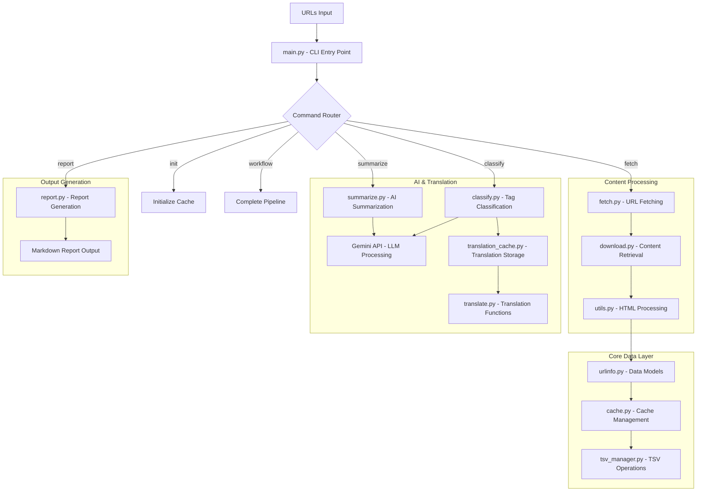

# url2md Package Architecture

This document provides a comprehensive overview of the url2md package architecture, including the purpose and relationships between all modules.

## Overview

url2md is a command-line tool for URL analysis and classification that generates Markdown reports through AI-powered content analysis, summarization, and classification. The package follows a centralized command architecture with function modules for clean separation of concerns.

## System Flow

## Package Structure and Module Documentation

### Core Entry Points

#### [`__init__.py`](__init__.md)
Package initialization and public API definition. Exports commonly used components including HTML utilities, download functionality, data models, and caching.

#### [`main.py`](main.md)
**Central command orchestrator** - The main CLI entry point implementing centralized command architecture. Routes all subcommands (init, fetch, summarize, classify, report, workflow) through a single dispatcher with consistent argument parsing and error handling.

### Data Models and Cache Management

#### [`urlinfo.py`](urlinfo.md)
**Core data structures** - Contains the `URLInfo` dataclass representing cached URL information. Handles URL metadata, TSV serialization/deserialization, and intelligent content fetching with Playwright/requests integration.

#### [`cache.py`](cache.md)
**Cache management system** - Manages persistent storage of URL metadata using TSV format. Provides domain-based throttling, file organization, and CRUD operations for cached content and summaries.

#### [`tsv_manager.py`](tsv_manager.md)
**Base TSV file operations** - Abstract base class for TSV file management with data sanitization, atomic write operations, and consistent file handling patterns used by cache and translation systems.

### Content Processing

#### [`fetch.py`](fetch.md)
**URL fetching command** - Implements the fetch subcommand with progress tracking, domain throttling, error handling, and statistics reporting. Orchestrates content retrieval and cache storage.

#### [`download.py`](download.md)
**Dynamic content retrieval** - Playwright-based web content downloading with fallback to requests. Handles JavaScript-heavy sites, binary file detection, and provides smart content type detection.

#### [`utils.py`](utils.md)
**HTML processing utilities** - Content extraction, HTML parsing, text minification, and package resource management. Provides cache directory detection and file organization utilities.

### AI Processing and Translation

#### [`schema.py`](schema.md)
**Pydantic schema definitions** - Consolidated schema definitions for all AI operations. Provides type-safe Pydantic models for summarization, classification, and translation with multi-language support and dynamic field generation.

#### [`summarize.py`](summarize.md)
**AI-powered summarization** - Gemini API integration for content summarization with multi-language support, progress tracking, and structured output generation using Pydantic schemas.

#### [`classify.py`](classify.md)
**Tag extraction and classification** - Extracts tags from summaries and performs LLM-based theme classification. Integrates with translation system for multi-language output and provides thinking process visualization.

#### [`translate.py`](translate.md)
**Generic translation functions** - Reusable LLM-based translation with dynamic schema generation. Provides translation prompt creation and term translation for any language with structured output.

#### [`translation_cache.py`](translation_cache.md)
**Translation caching system** - TSV-based persistent storage for translated UI terms. Implements cache-first approach to minimize API calls and provides efficient translation lookup for report generation.

### Report Generation

#### [`report.py`](report.md)
**Markdown report generation** - Creates comprehensive reports from classification results with multi-language support, theme-based organization, subsection generation, and URL tag priority ordering.

## Key Design Patterns

### Centralized Command Architecture
- **Single Entry Point**: `main.py` serves as the central orchestrator
- **Function Modules**: Each subcommand implemented as pure function modules
- **Clean Separation**: CLI logic centralized, business logic distributed

### Data Flow Architecture
1. **Input Processing**: URLs → URLInfo objects → Cache storage
2. **Content Analysis**: Cached content → AI processing → Structured results
3. **Output Generation**: Classification + Summaries → Reports

### Cache-First Approach
- **Persistent Storage**: TSV-based caching for all operations
- **Incremental Processing**: Only process new or changed content
- **Translation Optimization**: Cache translations to minimize API usage

### Error Handling Philosophy
- **Fail Fast**: Critical errors exit immediately with stack traces
- **Graceful Degradation**: Optional operations continue on errors
- **Exception Propagation**: Natural error flow for debugging

## Module Dependencies

### External Dependencies
- **Gemini API**: AI summarization and classification (via llm7shi)
- **Playwright**: Dynamic web content rendering
- **Requests**: HTTP client for static content
- **BeautifulSoup**: HTML parsing and processing

### Internal Dependencies
- **Core Layer**: urlinfo.py ← cache.py ← tsv_manager.py
- **Processing Layer**: fetch.py → download.py → utils.py
- **AI Layer**: summarize.py, classify.py → translate.py → translation_cache.py
- **Output Layer**: report.py → (all above layers)

## Development Workflow

1. **Initialization**: Create cache structure with `init` command
2. **Content Fetching**: Download and cache web content with `fetch`
3. **AI Processing**: Generate summaries and classifications
4. **Report Generation**: Create final Markdown reports
5. **Workflow Integration**: Single command for complete pipeline

## Configuration and Environment

- **Cache Directory**: Auto-detected or explicitly specified
- **API Keys**: GEMINI_API_KEY for AI operations
- **Models**: Configurable Gemini model selection
- **Languages**: Multi-language support for summaries and reports

This architecture enables maintainable, testable, and extensible code while providing a clean user interface for complex AI-powered content analysis workflows.